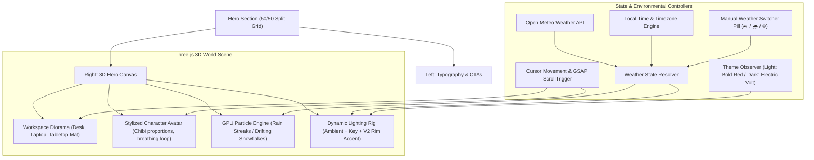

# 3D Hero World Implementation Plan (`hero2.md`)

> **Executive Overview**  
> Replace the current abstract 3D torus knot sculpture ("the blob") on the right side of the hero section with an interactive, living **"3D World of Mine"** diorama. This personal workspace scene features a stylized 3D avatar at a tactile desk, reactive atmospheric lighting synchronized with the site's Version 2 Red/Volt design system, and a real-time GPU-accelerated weather engine (Sunny, Rainy, Snowy) that dynamically resolves according to visitor timezone, local time-of-day, and live weather conditions.

---

## Architecture at a Glance



---

## Phase 1: Visual Design & Spatial Architecture of the Hero Section

Phase 1 establishes the comprehensive visual design, spatial balance, color harmony, and aesthetic blueprint for the hero section before entering scene coding.

### 1.1 Spatial Layout & Composition
- **Viewport Balancing (55/45 Division)**:
  - **Left Column (55% width)**: Houses the typographic hierarchy:
    - Micro-tag line: `UI/UX DESIGN • PRODUCT • WRITING • EXPERIMENTS` (styled in Version 2 accent pill typography).
    - Hero Headline: *“Designing ideas into experiences.”* with high-contrast serif/sans interplay and italicized Red/Volt emphasis.
    - Lede paragraph & dual magnetic action buttons (*"Explore my work"* and *"About me"*).
  - **Right Column (45% width)**: Replaces the red-boxed torus knot blob with an unobstructed, transparent WebGL viewport dedicated to the **3D Personal Workspace World**.
- **Camera Perspective & Framing**:
  - **Perspective**: Soft isometric three-quarters angle (`camera.position.set(0, 1.8, 3.5)`, looking at `(0, 0.5, 0)` with a 45° Field of View).
  - **Framing**: The workspace appears anchored naturally on the right side of the desk surface, aligned vertically with the center of the hero headline.
  - **Mobile Stacking**: Below `1024px`, the layout smoothly converts to a vertical stack; the 3D diorama is positioned between the CTA buttons and the "Scroll to explore" indicator at an optimized scale (`0.7x`) to prevent blocking text readability.

### 1.2 The 3D World Concept & Diorama Assets
The 3D world is an intimate, charming diorama representing the creative designer's workspace:
1. **The Minimalist Designer Desk**:
   - Primary desk surface modeled as a beveled floating block (`4.0w x 0.2h x 2.5d`).
   - Tactile Desk Mat (`3.8w x 2.3d`) with a subtle `0.001` elevation to eliminate Z-fighting.
   - Material roughness and metalness dynamically react to weather (e.g., higher reflectivity and lower roughness during rain to simulate atmospheric humidity and slickness).
2. **Desktop Creative Artifacts**:
   - Minimalist ultra-thin laptop with a glowing display panel facing the avatar.
   - Stylized ceramic coffee mug with low-poly steam particles.
   - Small desk plant / succulent in a geometric pot.
   - Warm desk task lamp casting localized specular highlights.
3. **The Stylized Character Avatar**:
   - **Proportions**: "Chibi" / stylized aesthetic (oversized rounded head, simplified cylindrical torso, mitten hands resting gently on the desk or keyboard).
   - **Polygon Budget**: Strictly capped between 600–900 vertices for 60 FPS performance across mobile and desktop.
   - **Facial Readability**: Minimalist expressive dark sphere eyes (`0.03` radius) and subtle micro-accessories (e.g., designer glasses or headphones).
   - **Procedural Idle Micro-Animations**:
     - Gentle sinusoidal breathing rhythm (`avatar.scale.y = 1 + sin(time * 0.8) * 0.02`).
     - Subtle interactive cursor tracking where the avatar's head turns slightly towards the visitor's cursor position (`targetX / targetY` lerp).
     - Periodic micro-glance upward towards the weather atmosphere.

### 1.3 Lighting Rig & Version 2 Theme Synchronization
The lighting directly integrates with the design tokens of Version 2:
- **Light Theme (Olive & Linen / Precision Studio)**:
  - **Ambient Light**: Clean daylight white (`#FFFFFF`, intensity: `1.4`).
  - **Key Directional Light**: Warm sun angle from upper right (`#FFFBF5`, intensity: `2.2`, position: `(5, 10, 7)`).
  - **Rim Accent Light**: Bold Red signature glow (`#FF0000`, intensity: `2.6`, position: `(-3, -1, -2)`), defining the outer silhouette of the desk and avatar.
  - **Desk Tone**: Warm Scandinavian birch / oak (`#8D6E63` base, `#6D4C41` mat).
- **Dark Theme (Deep Noir / Cyber Studio)**:
  - **Ambient Light**: Deep midnight indigo (`#141724`, intensity: `0.9`).
  - **Key Directional Light**: Cool moonlit studio light (`#D8E2FF`, intensity: `1.6`, position: `(4, 8, 5)`).
  - **Rim Accent Light**: High-voltage Electric Volt signature glow (`#D2F75A`, intensity: `3.2`, position: `(-3, -1, -2)`), casting an unmistakable neon rim along the avatar's edges.
  - **Desk Tone**: Matte obsidian noir / charcoal walnut (`#1A1A1A` base, `#222222` mat).

### 1.4 Floating Weather Control Interface
- Floating discreetly on the hero section's bottom-right periphery (or docked cleanly beside the CTA cluster):
  - **Glassmorphism Pill**: Frosted translucent container (`backdrop-filter: blur(16px)`, `background: rgba(var(--bg-rgb), 0.65)`, border: `1px solid var(--border-color)`).
  - **Mode Buttons**:
    - ☀️ **Clear / Sunny**: Golden sun icon with hover tooltip.
    - 🌧️ **Rainy**: Soft droplet icon triggering rain particle streaks and wet desk reflections.
    - ❄️ **Snowy**: Snowflake icon triggering drifting particle snowfall.
    - 🌐 **Auto / Sync**: Indicator showing that weather is synchronized in real-time with the visitor's geographic location and local time.
  - **Micro-Interactions**: Active mode glows with the theme accent (Red in Light mode, Volt in Dark mode) and scales up with spring physics.

### 1.5 Fallback State & Brand Integrity
- If WebGL is unsupported or loading:
  - An elegant CSS-rendered vector silhouette of the workspace and avatar fades in with a soft ambient pulse.
  - No layout shift (CLS = 0), as the canvas container maintains fixed aspect-ratio bounds.

---

## Phase 2: Scene Engine & Geometry Architecture

Phase 2 builds the Three.js scene graph, asset loading pipeline, and procedural fallbacks in `HeroScene.tsx`.

### 2.1 Three.js Canvas & Renderer Pipeline
- **Renderer Setup**:
  - `alpha: true` (transparent canvas blending seamlessly with page background).
  - `antialias: true` with automatic fallback if low GPU detected.
  - `powerPreference: "high-performance"`.
  - Resolution capping: `renderer.setPixelRatio(Math.min(window.devicePixelRatio, 2))` to prevent mobile 3x/4x GPU fillrate exhaustion.
- **Scene Graph Hierarchy**:
  ```
  Scene
  ├── LightingGroup (AmbientLight, KeyLight, DynamicRimLight)
  ├── EnvironmentGroup
  │   ├── DeskMesh (BoxGeometry)
  │   ├── TabletopMatMesh (PlaneGeometry with 0.001 Z-offset)
  │   └── DeskAccessories (Laptop, Mug, Succulent)
  ├── CharacterGroup
  │   ├── AvatarModel (GLTF / Procedural fallback)
  │   └── IdleAnimationMixer
  └── WeatherParticleGroup
      ├── RainPoints (Custom ShaderMaterial)
      └── SnowPoints (Custom ShaderMaterial)
  ```

### 2.2 Procedural Avatar Fallback (Zero External Asset Dependency)
To ensure the hero world renders instantly on initial load without waiting for external network downloads:
- Programmatic generation of stylized avatar meshes using Three.js primitives:
  - **Head**: `SphereGeometry(0.18, 24, 24)` scaled slightly on Y (`0.85x`).
  - **Body**: `CylinderGeometry(0.2, 0.22, 0.5, 12)` with rounded cap.
  - **Eyes**: Two glossy black mini spheres positioned at `(-0.06, 0.65, 0.15)` and `(0.06, 0.65, 0.15)`.
  - **Limbs**: Smooth jointed box/capsule meshes resting on the desk mat.
- Instant fallback readiness (`isAvatarReady = true` in < 1 frame).

### 2.3 Production GLTF/GLB Asset Loader Pipeline
- Dedicated `GLTFLoader` with `DRACOLoader` support for when a custom 3D model is supplied:
  - Supported format: `.glb` (binary) < 150KB gzipped.
  - Texture map: Basis Universal (`.basis` / KTX2) or 1024px JPEG at 85% quality.
  - Rigging: Mixamo A-pose skinning with 2-second looped idle breathing animation.
  - Automatic centering and bounding-box normalization so any avatar model scales to the exact desk proportions.

---

## Phase 3: GPU-Accelerated Weather Particle Engine

Phase 3 implements the high-performance particle systems inspired by `hero.md`, moving 100% of particle physics to GPU vertex shaders for zero CPU garbage collection.

### 3.1 Rain Particle System (Vertical Streaks)
- **Geometry**: `THREE.BufferGeometry` with 60 instanced drop vertices.
- **Attributes**: `position` (`Float32Array(180)`) and `velocity` (`Float32Array(180)`).
- **Custom ShaderMaterial**:
  - **Vertex Shader**:
    - Drops fall continuously based on `velocity * time * 0.5`.
    - Drop recycling loop: when `pos.y < -0.5`, wraps back to top (`y = 3.0 + random`).
    - Velocity stretch: elongates drops along the Y-axis to form authentic raindrops.
    - Soft fade near the desk surface using `smoothstep(0.0, 0.4, pos.y + 0.5)` to simulate splashing/absorption.
  - **Fragment Shader**:
    - Crisp translucent droplet color (`rgba(0.75, 0.85, 1.0, alpha * 0.45)`).
    - `AdditiveBlending` with `depthTest: false` for optimal draw speed.
- **Environmental Reaction**:
  - Desk mat roughness drops from `0.85` to `0.20`, and metalness increases to `0.35` to produce a sleek wet sheen reflecting the key light.

### 3.2 Snow Particle System (Soft Drifting Flakes)
- **Geometry**: `THREE.BufferGeometry` with 40 point particles.
- **Attributes**: `position`, `velocity` (including horizontal wind drift), and randomized `size` (`0.05` to `0.13`).
- **Custom ShaderMaterial**:
  - **Vertex Shader**:
    - Flakes gently drift with horizontal sway: `pos.x += sin(time * 0.5 + position.x) * 0.15`.
    - Size attenuation: `gl_PointSize = size * 300.0 / mvPosition.w`.
  - **Fragment Shader**:
    - Radial discard: `distance(gl_PointCoord, vec2(0.5)) > 0.5 ? discard : gl_FragColor`.
    - Produces soft circular snowflakes without requiring external PNG textures.
- **Environmental Reaction**:
  - Desk mat roughness transitions to `0.95` (velvety matte snow texture).

### 3.3 Clear / Sunny State
- Particle groups set to `visible = false`.
- Direct warm specular bounce active on desktop accessories and avatar hair/clothing.

---

## Phase 4: Weather State Resolver & Timezone-Aware Logic

Phase 4 integrates the multi-layered weather resolution engine from `hero.md`, guaranteeing realistic atmospheric conditions that respect visitor location and time of day.

### 4.1 Resolution Hierarchy & Logic Flow
The active weather state is resolved via a 4-tier decision cascade:
1. **Tier 1 — Manual User Override**:
   - If the visitor clicks a weather button (☀️, 🌧️, or ❄️), their preference is honored immediately and persisted in `localStorage` for 24 hours.
2. **Tier 2 — Time-of-Day Realism Filter**:
   - Evaluates the visitor's local hour (`0–23`) derived from client time or location timezone.
   - **Night Constraints (8:00 PM – 6:00 AM)**: Clear sky weather codes (Code 0, 1) are prohibited from rendering blazing sunny daylight. Instead, they resolve to a serene "Moonlit / Overcast" mood with deep ambient shadows and luminous rim accents.
   - **Snow Realism**: Snow during hot daytime hours is suppressed unless temperatures are below freezing.
3. **Tier 3 — Live Open-Meteo API Forecast**:
   - Lightweight fetch to `https://api.open-meteo.com/v1/forecast?current_weather=true`.
   - Comprehensive mapping of WMO weather codes (0–99) to the 3 visual states:
     - `0–2` ➔ Sunny / Clear (or Moonlit if night).
     - `51–67, 80–82, 95–99` ➔ Rainy (with dynamic intensity modifier).
     - `71–77, 85–86` ➔ Snowy.
4. **Tier 4 — Instant Client-Side Fallback**:
   - If offline or API fails, calculates time-of-day directly from `new Date().getHours()` (<0.1ms computation, zero blocking).
   - 15-minute `localStorage` cache prevents redundant network calls.

### 4.2 Code Integration Structure
```typescript
interface WeatherResolution {
  type: 'sunny' | 'rainy' | 'snowy' | 'overcast_night';
  source: 'override' | 'api' | 'fallback';
  temperature?: number;
}

export function resolveWeatherState(
  weatherCode?: number, 
  userOverride?: string | null,
  localHour?: number
): WeatherResolution {
  if (userOverride) {
    return { type: userOverride as any, source: 'override' };
  }
  
  const hour = localHour ?? new Date().getHours();
  const isNight = hour >= 20 || hour < 6;
  
  // WMO Code Translation
  if (weatherCode !== undefined) {
    if ([71, 73, 75, 77, 85, 86].includes(weatherCode)) {
      return { type: 'snowy', source: 'api' };
    }
    if ([51, 53, 55, 61, 63, 65, 80, 81, 82, 95].includes(weatherCode)) {
      return { type: 'rainy', source: 'api' };
    }
    if (isNight) {
      return { type: 'overcast_night', source: 'api' };
    }
    return { type: 'sunny', source: 'api' };
  }
  
  // Fallback
  return { 
    type: isNight ? 'overcast_night' : 'sunny', 
    source: 'fallback' 
  };
}
```

---

## Phase 5: Interactive Physics, Parallax & Scroll Choreography

Phase 5 choreographs how the 3D world responds to user input, cursor hover, and page scrolling.

### 5.1 Subtle Mouse Tracking Parallax
- Smooth lerping on `mousemove`:
  ```typescript
  targetX = (e.clientX / window.innerWidth - 0.5) * 0.4;
  targetY = (e.clientY / window.innerHeight - 0.5) * 0.3;
  
  currentX += (targetX - currentX) * 0.04;
  currentY += (targetY - currentY) * 0.04;
  
  // Natural subtle rotation of the entire diorama
  worldGroup.rotation.y = baseRotationY + currentX * 0.25;
  worldGroup.rotation.x = baseRotationX + currentY * 0.15;
  
  // Avatar head tracks mouse with subtle dampening
  avatarHead.rotation.y = currentX * 0.4;
  avatarHead.rotation.x = -currentY * 0.3;
  ```

### 5.2 GSAP ScrollTrigger Integration
- As the user scrolls down towards the Intro section:
  - The diorama gracefully translates downward (`y: -scrollProgress * 1.5`) and recedes into deep space (`z: -scrollProgress * 2.0`).
  - Subtle opacity roll-off via canvas style opacity prevents collision with the upcoming case study grid.
  - Seamless scrub control synchronized with GSAP (`scrub: 1.2`).

---

## Phase 6: Performance, Accessibility & Mobile Optimization

Phase 6 hardens the implementation against low-spec devices and accessibility preferences.

1. **Reduced Motion (`prefers-reduced-motion: reduce`)**:
   - Particle animation loops halt automatically.
   - Mouse parallax tracking is disabled.
   - Avatar adopts a calm, static resting pose.
2. **GPU & Memory Protection**:
   - `requestAnimationFrame` loop pauses when the hero section scrolls out of the active viewport (using `IntersectionObserver`).
   - WebGL context loss listeners (`webglcontextlost`, `webglcontextrestored`) prevent page crashes during OS sleep/wake cycles.
   - Geometry, materials, and textures are explicitly disposed on unmount to eliminate memory leaks.
3. **Responsive Breakpoints**:
   - `> 1200px`: Full 3D diorama positioned on the right with full particle count.
   - `768px – 1199px`: Scaled to `0.85x`, camera pulled back slightly to accommodate tablet aspect ratios.
   - `< 768px` (Mobile): Centered below hero text, particle count reduced by 50% (30 rain drops, 20 snowflakes), touch drag disabled to preserve smooth native scrolling.

---

## Phase 7: Verification & Testing Matrix

| Test Case | Method | Expected Outcome |
| :--- | :--- | :--- |
| **Theme Switching** | Toggle Dark / Light button in Navbar | Rim light smoothly lerps between Bold Red (`#FF0000`) and Electric Volt (`#D2F75A`); desk material tones adjust without scene flicker. |
| **Weather Switching** | Click ☀️, 🌧️, ❄️ buttons | Particle systems toggle instantly; tabletop roughness updates to wet gloss on rain and velvety matte on snow. |
| **Night Realism** | Simulate 2:00 AM local time | Sunny daylight is blocked; scene renders serene moonlit ambient lighting. |
| **GSAP Scroll Scrub** | Scroll down page past hero | Diorama recedes smoothly into the background along the Z/Y axes without jank or scroll hitching. |
| **Reduced Motion** | Enable `prefers-reduced-motion` in OS | Particles remain stationary; mouse tracking disabled; zero motion discomfort. |
| **Build & Bundle** | `npm run build` | Clean TypeScript compilation, zero bundle bloat (<150KB addition). |

---

*Plan formulated and structured for execution in portfolio-web.*
